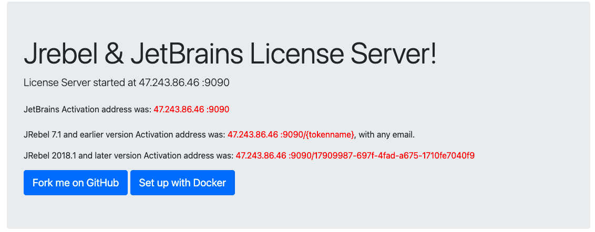

# Jrebel License Server

A spring boot based Jrebel License Server. 

docker image available [here](https://hub.docker.com/repository/docker/imjcker/jrebel)

A personal free server:
> http://jrebel.imjcker.com  
> http://jrebel.nas.imjcker.com:9090 (for backup use)

## Usage

```shell script
java -jar jrebel-license-server-1.0.0.jar 

# run daemond

nohup java -jar jrebel-license-server-1.0.0.jar >/dev/null 2>&1 &

# for docker users

sudo docker run -d --name jrebel-license-server -p 9090:9090 --restart always imjcker/jrebel:latest

```

微信公众号  


博客小程序  


[license]: https://www.apache.org/licenses/LICENSE-2.0

