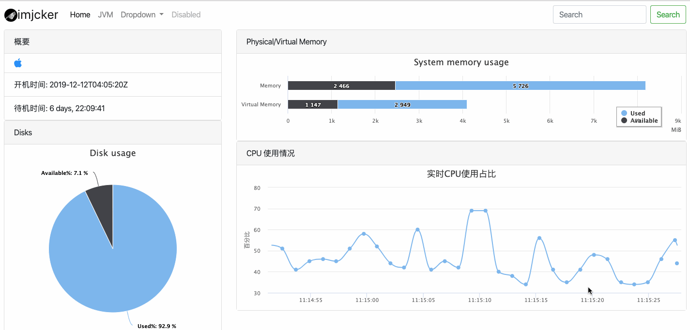

# Jrebel License Server

A spring boot based Jrebel License Server. 

docker image available [here](https://hub.docker.com/repository/docker/imjcker/jrebel)

## Usage

```shell script
java -jar jrebel-license-server-1.0.0.jar 

# run daemond

nohup java -jar jrebel-license-server-1.0.0.jar >/dev/null 2>&1 &

# for docker users

sudo docker run -d --name jrebel-license-server -p 9090:9090 --restart always imjcker/jrebel:latest

```


# oshi-spring-boot-starter
[][license]

oshi integrated with spring boot, easy to use.

```xml
<dependency>
    <groupId>com.imjcker</groupId>
    <artifactId>oshi-spring-boot-starter</artifactId>
    <version>1.0.1</version>
</dependency>
```

```yaml
# default configuration
imjcker:
  oshi:
    sys-view-servlet:
      enbled: true
      url-pattern: /oshi/*

```
微信公众号  


demo示例  



[license]: https://www.apache.org/licenses/LICENSE-2.0

